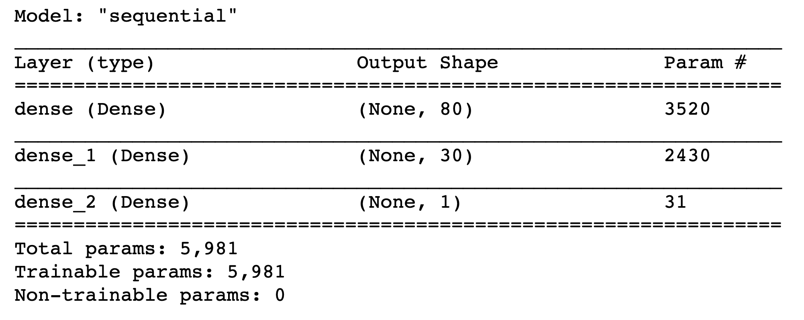
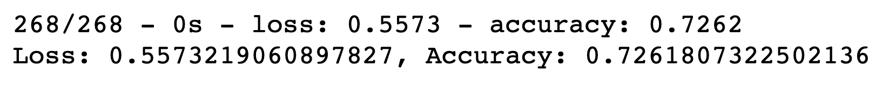
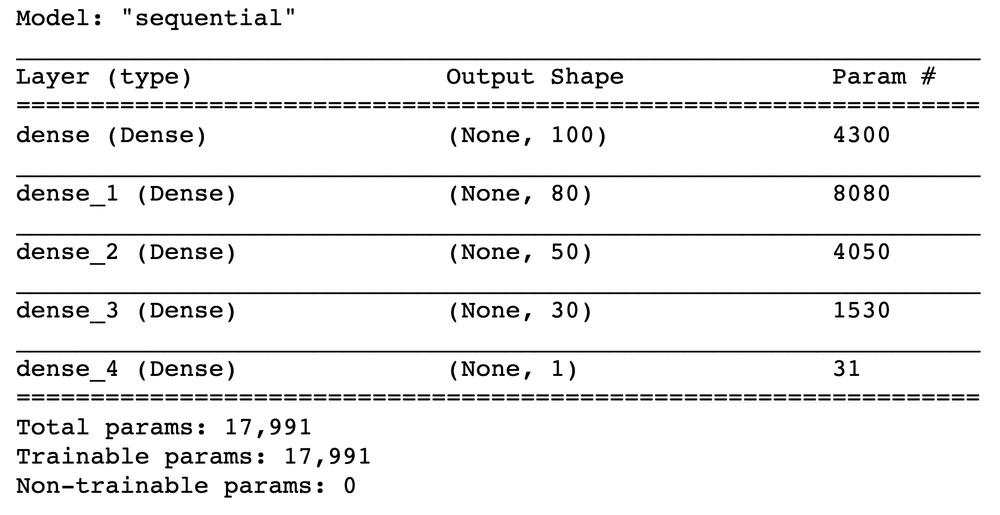
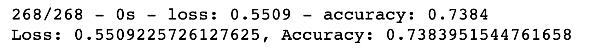
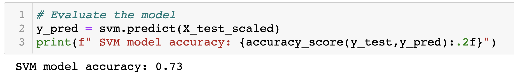

# **Neural_Network_Charity_Analysis**
- Analyse and predict the success of the charity contribution employing Neural Networks using python libraries - sklearn, TensorFlow and Pandas.
---
## Overview of the Project :
- Alphabet Soup, is a non-profit foundation which intends to fund / contribute on noble and global causes for the betterment of humanity  through various reliable charitable institutions. 
- Alphabet Soup wants to make sure that the foundations charity is utilised effectively by the recepients. Alphabet Soup believes to reach its mission by predicting the success of their charity based on past performance data of all the contributions made to various charitable institutions.
- Data Analysis comes into picture, with a requirement for data modeling so that a trained Neural Network model can predict the future charity contributions. To accomplish this, various steps were carried out. 
- Firstly, data preprocessing was done so that the dataset was cleaned, transformed and processed so that it was ready to be fed into the desired model. Processing involved steps like getting rid of columns/rows which were unnecessary, identifying categorical data columns having more than 10 categories to reduce the categories by binning technique and converting the categorical data to numerical data using OnehotEncoder. Spliting the target y and features X, train and test y and X data, scale the train and test X data using Standard Scaler.
- Secondly defining the neural network model like number of input features, number of hidden layers, number of nodes in each layer, activation functions for each layer. Along with this the number of epochs for the model was defined. After defining and compiling, the model was trained with X_train_scaled and y_train data.
- After the model was trained, it was evaluated by passing the X_test_scaled data and comparing the resulting y_predicted with y_test data to define the metrics "Loss" & "Accuracy" of our model.
- Lastly, the model and the final results were saved as hdf5 file and also the weights of the model were saved as model checkpoints every 5 epochs. 
## **Results**
- The Alphabet Soup past performance dataset has data with 34299 rows and 12 columns.
    ### Data Preprocessing :
    - For this model the target variable should be something which defines the success or failure of the investment. This characteristic can be understood by the target "IS_SUCCESSFUL" hence it is the target. 
    - There are a number of features which are contributing to the success or failure of the investment in this dataset. Among the 11 columns, the following are the features for our model "APPLICATION_TYPE", "AFFILIATION", "CLASSIFICATION", "USE_CASE", "ORGANIZATION", "STATUS", "INCOME_AMT", "SPECIAL_CONSIDERATIONS", "ASK_AMT".
    - The columns "EIN" and "NAME" are just used for identifying various investment options, hence these dont contribute anything to the success or failure of the target. Hence these are removed from the data as they are neither target nor features.
    ### Compiling, Training and Evaluating the Model :
    - Before optimizing the model, 2 hidden layers, with 80 and 30 neurons were defined. Both the layers were assigned with "relu" activation function. 1st hidden layer takes around 40 input features hence opted 80 neuron based on the best practices of NN of using 2 to 3 times of input features. Reduced the number of neurons to 30 for the next layer so that model doesnt get overfitted to the training data. Selected Relu as it is best for the positive nonlinear input data for classification. Selected Sigmoid for the output layer as it is ideal for binary classification. 
    - </img>
    - Before optimizing the model, the model accuracy that we achieved = 0.726 meaning model is 72.6% accurate. We could not reach the target of 75%, hence we considered to optimize the model to increase the performance.
    - </img>
    -  OPTIMIZATION of the model to improve model performance :
        - As earlier EIN and NAME columns were removed and rest of the dataset was analysed to understand the noisy variables. STATUS column had only 2 unique values of 1 and 0. Among the 34299 rows of data, only 5 rows had the value of 0 which is a very small number when compared with complete dataset. Also, logically thinking STATUS seems to indicate that the charity in question is ACTIVE or NOT. 0 meant NOT, which implies that such charity which are no more Active should not be there in the dataset. Hence removed the 5 rows of data from the dataset. Once the rows of dataset is removed the index should be reset so that the index is reverted back to continuous numbering. If this step is not done, data will mismatch when merging the encoded data with the original dataset. 
        - One more column "SPECIAL_CONSIDERATIONS" has only 2 values Y and N with only 27 rows of data with Y value. Though it is small, logically it indicates of some special consideration to be given to a particular charity. This can have an effect on the success of the charity. Hence this variable was NOT removed from the dataset. 
        - Rest all other columns were categorical except for ASK_AMT which is numerical. Among the rest 6 categorical columns (leaving SPECIAL_CONSIDERATIONS), 3 of them - APPLICATION_TYPE, CLASSIFICATION, AFFILIATION were considered for binning based on the value_counts of their unique values. For Application_type and Classification the number of bins were increased than the ones before optimizing. Affiliation was reduced to 3 bins.  
        - Added 2 more hidden layers along with the 2 which were defined before optimizing to make it really a deep learning neural network of 4 hidden layers so that model uncovers all the patterns.
        - Number of neurons for 4 hidden layers were 100, 80, 50, 30. As already mentioned started with 100 following the general guideline of 2 or 3 times the number of inputs. The number was reduced for the next layers to avoid overfitting the model.
        - Based on repeated iterations of selecting various activation functions, a combination was observed to yield a better consistent result. A combination of relu - tanh - relu - tanh activation functions were used for the 4 layers. Relu being the best for the nonlinear input data for classification and then the tanh acts upon that expanding the range between -1 and 1. Sigmoid being the best of binary classification was kept same on the output layer.
        - </img>
        - Number of epochs were reduced to 50 (from 100 before optimizing) while optimizing the model. As the model that we defined was really deep with 4 layers and good number of neurons, using higher number of epochs like a 100 or 200 might contribute to overfitting of the model. 
        - Also, though the resources can be increased exponentially (hidden layers, number of neurons or epochs), no much gain of performance was observed beyond the best accuracy of 73.8%. Hence it is not worth the effort to go on increasing the resources though there is no gain in performance.
        - </img>
## **Summary**
- With all the efforts invested in optimizing the model we could achieve only a 1.2% better accuracy. Accuracy improved from 72.6% to 73.8%. This is a very very minor performance improvement by all standards.
- There are significant observations about the dataset itself. Dataset had only 1 numerical variable and rest all categorical. Also the categorical variables had its largest number belonging to 1 or 2 of its categories only.
- Above points indicate clearly that there is a need for collecting more data including some numerical data like number of yrs charity is operating, number of employees or team size working towards the project, number of projects run by the charity every year / in total, numerical data quantifying the success of charity and such others.
# Recommendation :
- Defining and evaluating a neural network is a costly affair with all the resources that needs to be allocated including the processing resources.
- For the current accuracy % of 73, we can as well look for cheaper options of Logistic regression or Support Vector Machine or Random Forest model. 
- Morever the dataset is such that the performance is not improving. Also this is a 1 task, binary classification problem, hence SVMs have an advantage over neural network. 
- Among the 3, SVM seems to be most efficient for this dataset.  When modeled and evaluated with the SVM, inexpensive computation for the same dataset, received an accuracy of 73% almost the same as Neural Network. 
- </img>
---
---